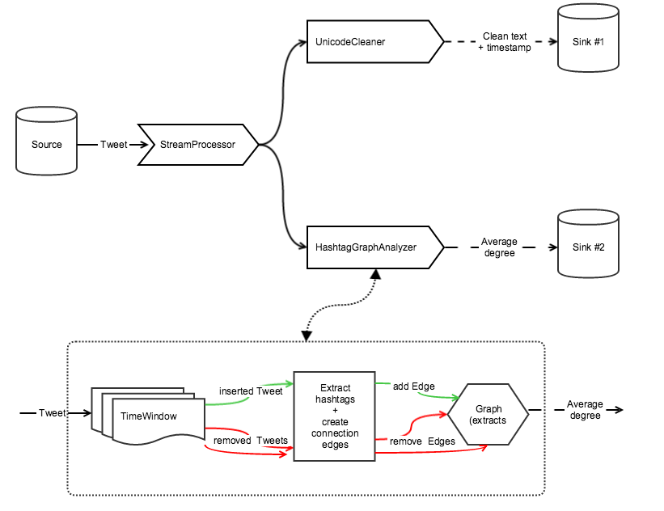

# ide

Despite being quite new to Scala (~2 months of on and off work), I decided to take a risk and attempt to write this project in it. There where a couple of reasons for that. First, I've only worked professionally in Ruby, which is a weakly-typed language. As our codebase grew larger, I've found myself wishing to have more tight control over object's types in order to reduce the number of unexpected behaviors (or code review times) after code changes. Scala's type safety reduces the cognitive load of keeping the whole project structure in my head as I modify it. Second, a lot of 'Big Data' tools are written in Scala. It seemed fitting to implement this in something that could be easily extended to run on parallel machines using available frameworks (like Spark), even if this was only a test project. And finally, I figured that even if I'm not accepted, at least I would have learned a lot of new things in just a few days that otherwise could have taken months..

With that in mind, here is how I've approached the problem.

First order of business was to abstract away data input and output. Data can be coming from a file or a stream or something else and, similarly, could be written to a file or S3 or maybe even persisted in memory for further use. None of that should affect internal logic, so I've added a concept of `Source` and `Sink`. The process then is to take a `Tweet` from `Source` and send it off to all consumers, each of which will perform a series of operations on it and store the output to its respective `Sink`. 

The `Source` converts a stream of strings from a file into a stream of `Tweet`s by attempting to convert each json string into a `Tweet`. If extraction fails, it just goes to the next element in the source stream. This way it's possible to clear out invalid tweets on the fly without storing anything in memory. 

The stream of `Tweet`s is then sent through a `StreamManager` whose only job, for now, is to split the stream and send the `Tweet` to individual consumers for custom processing. In this case, these are `UnicodeCleaner` and `HashtagGraphAnalyzer`. Currently it's doing it sequentially, but because I've taken more of a functional approach to this implementation, I think it should be relatively easy to make it asynchronous. 

The idea behind `UnicodeCleaner` is pretty simple - it takes `Tweet`'s text and removes all unicode characters, replaces all \n and \t characters with a single whitespace, and stores cleaned text to a `Sink`. At the same time, it also checks if any unicode characters were removed by comparing tweet's text before and after, and if there were, it increments the total number of tweets with unicode characters by 1. After the process terminates, it adds a footer to the sink with the number of tweets that contained unicode and saves it to file.

`HashtagGraphAnalyzer` is a little more complicated. The basic idea is that it is possible to keep track of changes to the graph without having to process the whole structure after a new tweet is added. This way updating average node degrees should be close to O(1) instead of O(number of tweets in the window). 
First, I've implemented `TimeWindow` which is a class that maintains reference to the latest tweet that was added to it, a list of tweets that were removed after the new tweet was added (which could be empty), as well as a sorted list of all the tweets currently inside the window by tweet's `created_at` field, with latest tweets being at the front. Because the list is sorted and because each new tweet is likely to be the youngest, adding it is close to O(1). Removing old tweets is O(N) in the worst case scenario, but should average out to ~O(1) over long run. Unfortunately, in my implementation, I ran out of time, and the `#droppedOlderThan` method in `TimeWindow` is actually O(N). Perhaps some sort of doubly linked list would be better for this case.
Then, I've added `Graph`, which is a class maintaining reference to the number of edges (#a <-> #b, #b <-> #c), number of connections for each node (#a -> 1, #b -> 2, #c -> 1), as well as the total number of unique nodes (3) and total number of degrees (4). As a new edge is added, it simply updates those references. Same thing happens when an edge is removed. 
So, `HashtagGraphAnalyzer` takes a tweet, figures out which tweets need to be added or removed from the time window, then generates hashtag edges from each tweet and adds or removes those edges from the current graph. Then the average node degrees value is taken from the updated graph and added to the sink. 

I tried to keep my code clean and easy to read, but I didn't get a chance to provide more thorough explanations with comments because I ran out of time. Hope this short writeup with a diagram below will make it easier to understand the flow. 

Thanks, 
Dan

